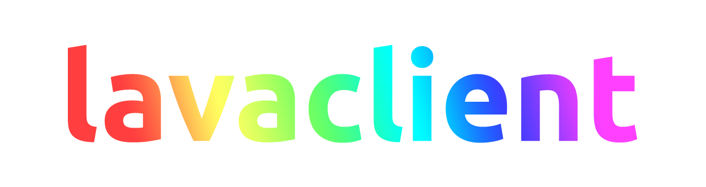

---

A lightweight and powerful [lavalink](https://github.com/freyacodes/lavalink) client for [nodejs](/lavaclient) & [deno](/lavadeno)

## Organization

This organization contains all of our projects, including the Deno & NodeJS lavalink clients!

- [**Dimensional Fun #lavaclient**](https://discord.gg/GQgM5pbJWm) Dedicated channel for everything lavaclient!

---

[dimensional fun](https:///www.dimensional.fun) &copy; 2019 - 2022
